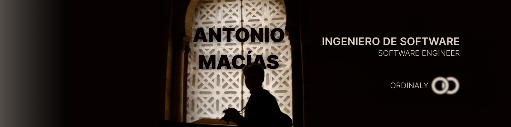
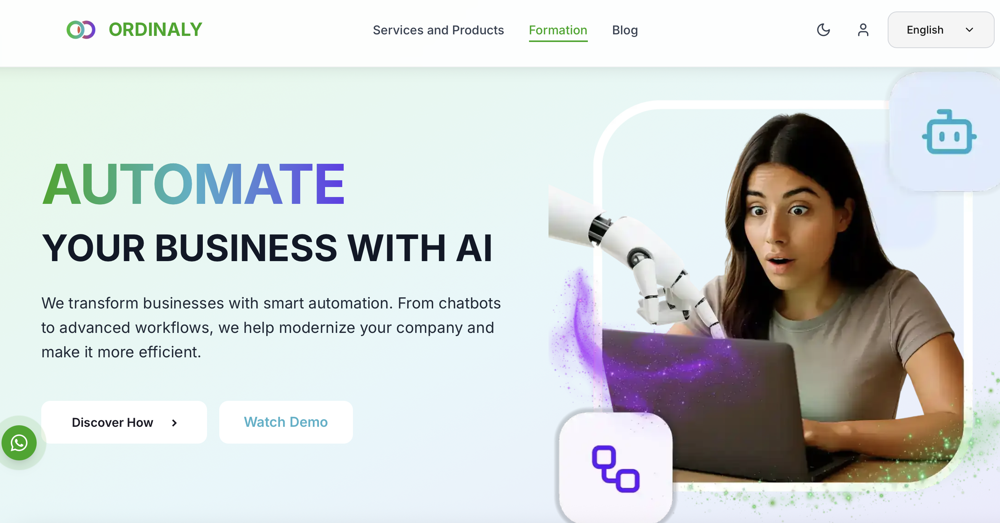
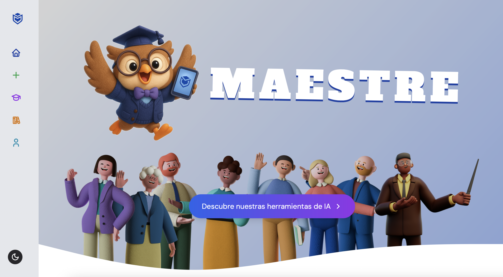
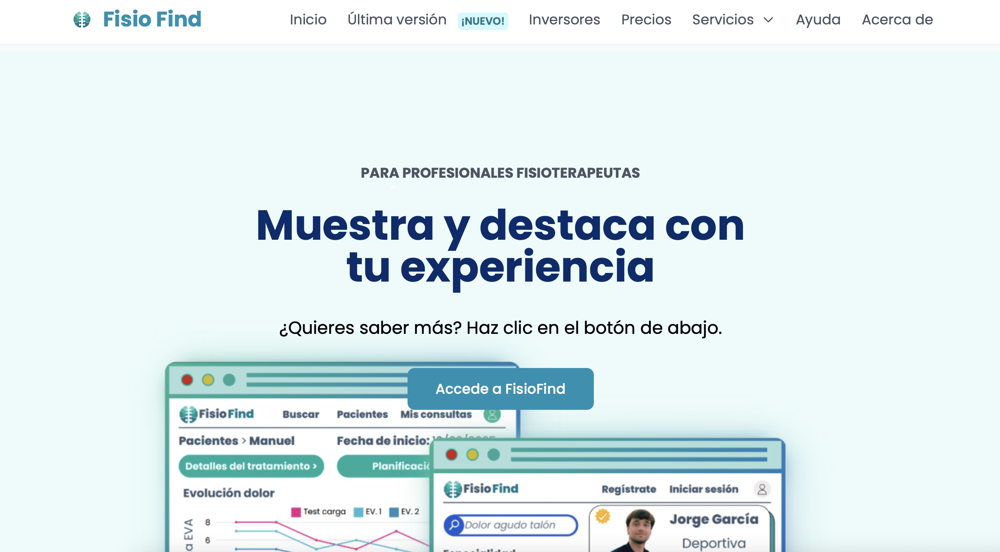
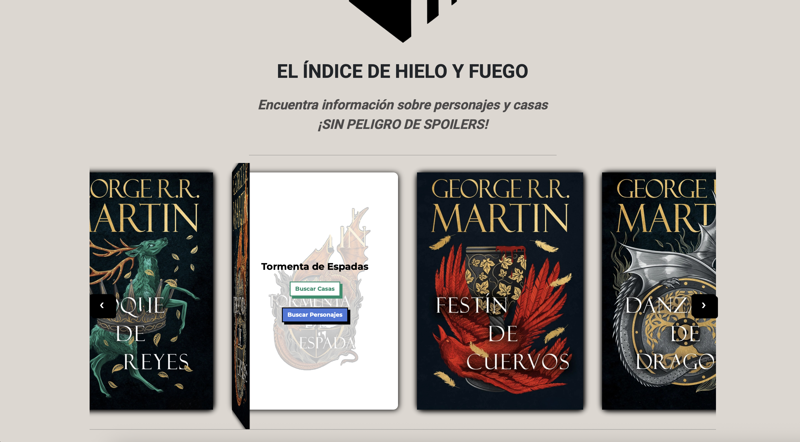
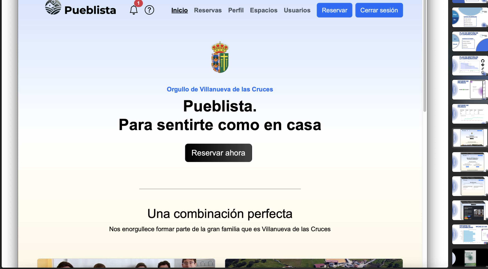
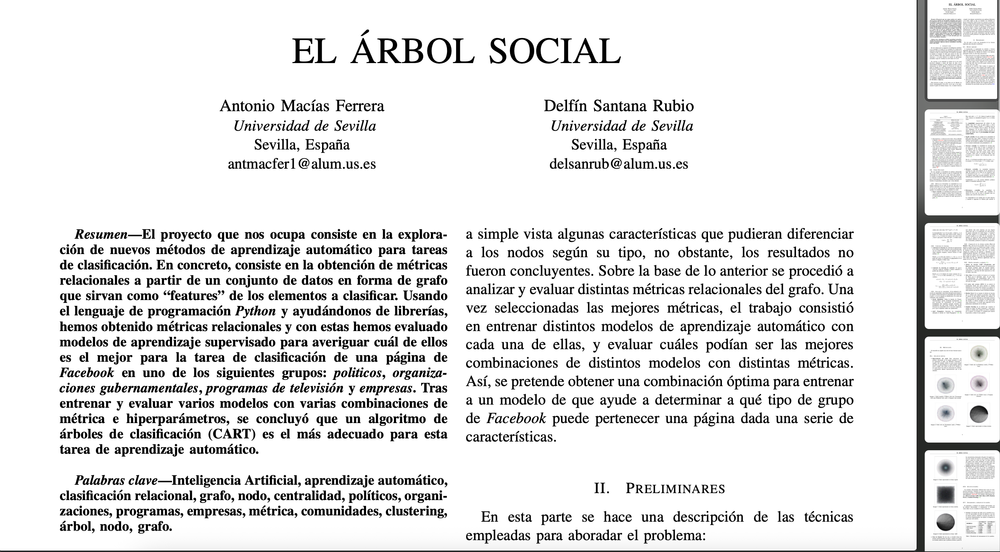

<h1 align="center">
  Hello there! I'm Antonio Macías 
</h1>

¡Hola a todos! Soy Antonio Macías

<!-- Language Switch -->
[🇬🇧 English](#english) | [🇪🇸 Español](#español)</b>

 

<h2 align="left">👨‍💻 | About me</h2>

Software Engineering graduate from the University of Seville, specialising in software architecture, artificial intelligence, and project management. I hold distinctions in key subjects such as Software Architecture and Integration, Professional Practice Engineering, and Configuration Management.

I am about to begin my professional journey as a Software Engineer at [ORDINALY SOFTWARE](https://ordinaly.ai/en), a start-up focused on automating and optimising business processes through Artificial Intelligence, in collaboration with AVIVA PUBLICIDAD and PROINCA CONSULTORES. Alongside this, I will pursue the Master’s Degree in Computer Engineering while continuing to develop my expertise in AI, data science, and software design.

During my studies, I gained hands-on experience in both academic and industry projects. Notably, my Bachelor’s Thesis involved the design and implementation of [MAESTRE](https://github.com/MAESTRE-TFG/maestre), a web-based AI toolkit aimed at helping secondary school teachers create and manage educational content. I also led and coordinated the design and development of [Fisio Find](https://github.com/Proyecto-ISPP/FISIOFIND), a multi platform application for physiotherapist focused on giving a complete service (video calls, scheduling tools, payments and treatments).

My technical skill set spans backend (Spring, Django), frontend (NextJS, React), databases (MySQL, PostgreSQL, MariaDB), and AI frameworks such as TensorFlow and PyTorch, complemented by experience in Docker, Google Cloud, and Agile methodologies (Scrum, PMBOK). I am fluent in Spanish and English (Cambridge C1 - 7.5 IELTS).

Outside of engineering, I am passionate about photography, videography, and cinema. My artistic/ hobby work can be found on my [Personal Page](http://bento.me/antoniommff).

 

<h2 align="left">📑 | Latest project</h2>

<table>
  <tr>
    <td align="center">
      
       
      
    </td>
    <td align="center">
      
       
      
    </td>
  </tr>
  <tr>
    <td align="center">
      
       
      
    </td>
    <td align="center">
      
       
      
    </td>
  </tr>
  <tr>
    <td align="center">
      
       
      
    </td>
    <td align="center" colspan="2">
      
       
      
    </td>
  </tr>
</table>

 

<h2 align="left">🛠️ | My skills</h2>
<table>
    <tr>
        <td style="font-weight: bold; padding-right: 10px; vertical-align: center; border: none;">AI tools ⚠️</td>
        <td>
          
          
          
          
          
          
          
      </td>
    </tr>
    <tr>
        <td style="font-weight: bold; padding-right: 10px; vertical-align: center; border: none;">Backend</td>
        <td></td>
    </tr>
    <tr>
        <td style="font-weight: bold; padding-right: 10px; vertical-align: center;">Frontend</td>
        <td>
          
          
        </td>
    </tr>
    <tr>
        <td style="font-weight: bold; padding-right: 10px; vertical-align: center; border: none;">Math</td>
        <td></td>
    </tr>
    <tr>
        <td style="font-weight: bold; padding-right: 10px; vertical-align: center; border: none;">Database</td>
        <td></td>
    </tr>
    <tr>
        <td style="font-weight: bold; padding-right: 10px; vertical-align: center; border: none;">Versioning and deployment</td>
        <td></td>
    </tr>
	 <tr>
        <td style="font-weight: bold; padding-right: 10px; vertical-align: center;">Automation</td>
        <td>
			
			
        	
        </td>
    </tr>
</table>

 

<h2 align="left">☎️ | Contact</h2>

[EN] Take a momment to look at my [Personal Page](http://bento.me/antoniommff) to explore my social media, where I usually post more artistic stuff.
For direct contact, you can reach me out though:  or 

 

---

	 
	 
	 
	 
  	 
	 
	 
	 

<h2 align="left">👨‍💻 | Sobre mi</h2

Graduado en Ingeniería del Software por la Universidad de Sevilla, especializado en arquitectura de software, inteligencia artificial y gestión de proyectos. Con MH en asignaturas clave como Arquitectura e Integración de Sistemas Software, Ingeniería y Gestión de Configuración.

Estoy a punto de comenzar mi trayectoria profesional como Ingeniero de Software en [ORDINALY SOFTWARE](https://ordinaly.ai/es), una start-up centrada en la automatización y optimización de procesos empresariales mediante Inteligencia Artificial, en colaboración con AVIVA PUBLICIDAD y PROINCA CONSULTORES. Paralelamente, cursaré el Máster en Ingeniería Informática mientras continúo desarrollando mis conocimientos en IA, ciencia de datos y diseño de software.

Durante mis estudios, adquirí experiencia práctica tanto en proyectos académicos como en la industria. Destaca mi Trabajo de Fin de Grado, que consistió en el diseño e implementación de [MAESTRE](https://github.com/MAESTRE-TFG/maestre), un conjunto de herramientas de IA basado en la web destinado a ayudar a los profesores de secundaria a crear y gestionar contenido educativo. También lideré y coordiné el diseño y desarrollo de [Fisio Find](https://github.com/Proyecto-ISPP/FISIOFIND), una aplicación multiplataforma para fisioterapeutas enfocada en ofrecer un servicio completo (videollamadas, herramientas de programación, pagos y tratamientos).

Mi conjunto de habilidades técnicas abarca el desarrollo backend (Spring, Django), frontend (NextJS, React), bases de datos (MySQL, PostgreSQL, MariaDB) y frameworks de IA como TensorFlow y PyTorch, complementado con experiencia en Docker, Google Cloud y metodologías ágiles (Scrum, PMBOK). Hablo español e inglés con fluidez (Cambridge C1 - 7.5 IELTS).

Fuera del ámbito de la ingeniería, me apasionan la fotografía, la videografía y el cine. Mi trabajo artístico y de afición se puede encontrar en mi página personal [Página Personal](http://bento.me/antoniommff).

 

<h2 align="left">📑 | Últimos proyectos</h2>

<table>
  <tr>
    <td align="center">
      
       
      
    </td>
    <td align="center">
      
       
      
    </td>
  </tr>
  <tr>
    <td align="center">
      
       
      
    </td>
    <td align="center">
      
       
      
    </td>
  </tr>
  <tr>
    <td align="center">
      
       
      
    </td>
    <td align="center" colspan="2">
      
       
      
    </td>
  </tr>
</table>

 

<h2 align="left">🛠️ | Mis habilidades técnicas</h2>
<table>
    <tr>
        <td style="font-weight: bold; padding-right: 10px; vertical-align: center; border: none;">Herramientas de IA ⚠️</td>
        <td>
          
          
          
          
          
          
          
      </td>
    </tr>
    <tr>
        <td style="font-weight: bold; padding-right: 10px; vertical-align: center; border: none;">Backend</td>
        <td></td>
    </tr>
    <tr>
        <td style="font-weight: bold; padding-right: 10px; vertical-align: center;">Frontend</td>
        <td>
          
          
        </td>
    </tr>
    <tr>
        <td style="font-weight: bold; padding-right: 10px; vertical-align: center; border: none;">Matemática</td>
        <td></td>
    </tr>
    <tr>
        <td style="font-weight: bold; padding-right: 10px; vertical-align: center; border: none;">Gestión de bases de datos</td>
        <td></td>
    </tr>
    <tr>
        <td style="font-weight: bold; padding-right: 10px; vertical-align: center; border: none;">Gestión de versiones y despliegue</td>
        <td></td>
    </tr>
	<tr>
        <td style="font-weight: bold; padding-right: 10px; vertical-align: center;">Automation</td>
        <td>
			
			
        	
        </td>
    </tr>
</table>

 

<h2 align="left">☎️ | Contacto</h2>

Tómate un momento para echar un vistazo a mi [Página personal](http://bento.me/antoniommff) para explorar mis redes sociales, donde normalmente publico cosas más artísticas.
Para un contactarme directamente:   o 

---

