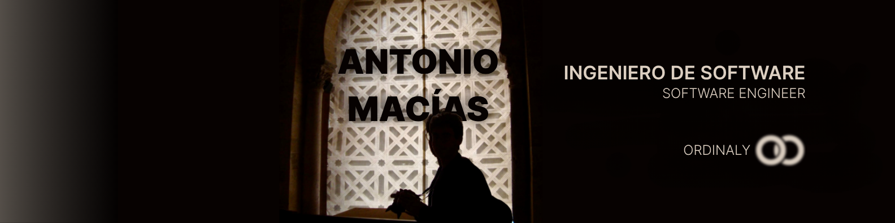
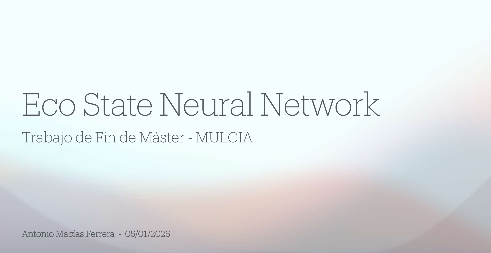
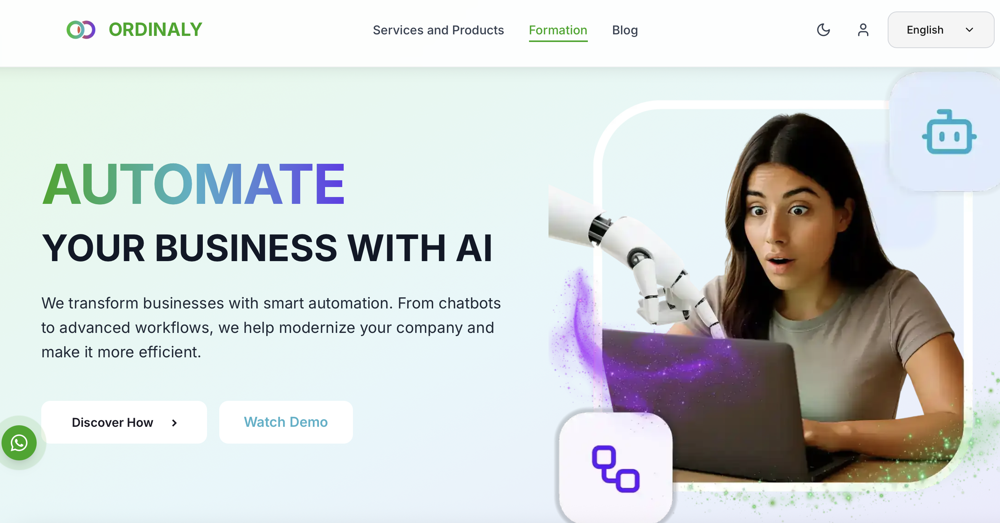
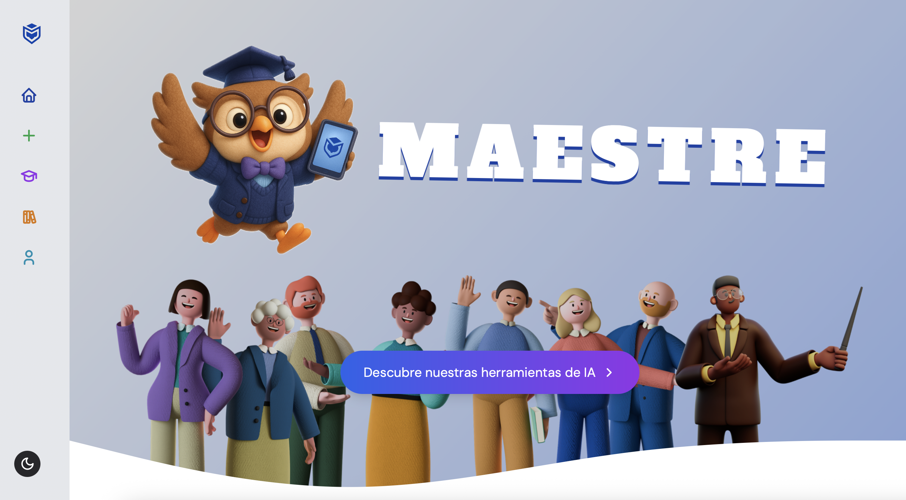
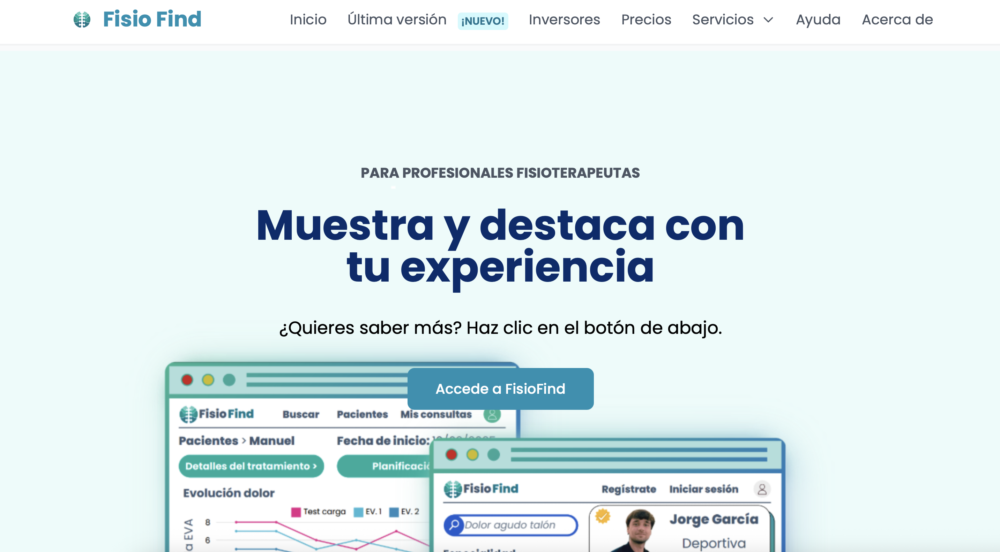
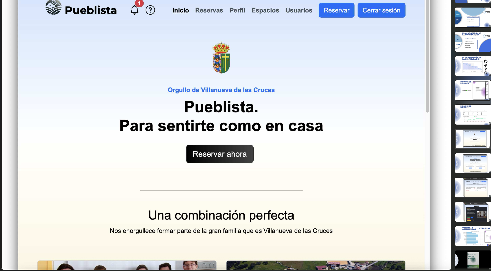
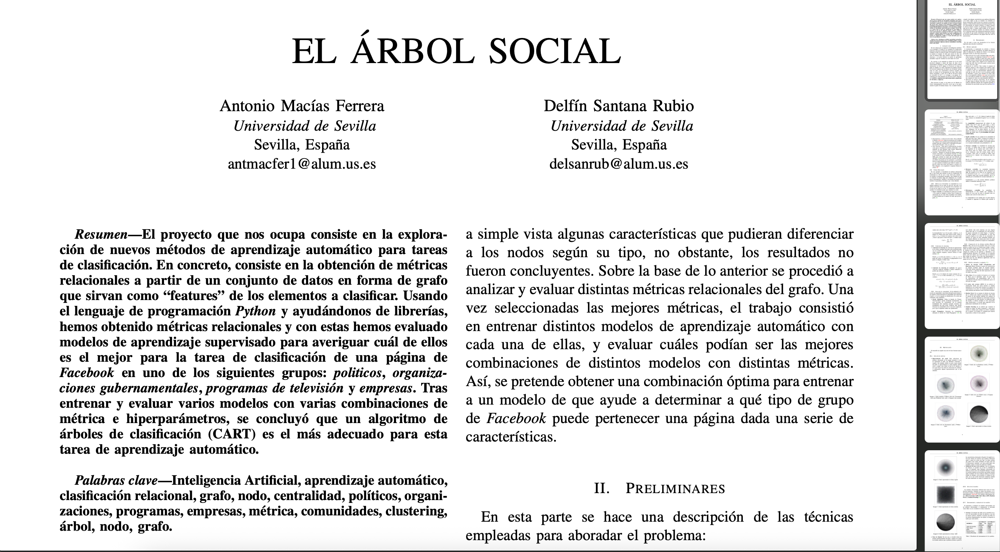

<h1 align="center">
  Hello there! I'm Antonio Macías 
</h1>

¡Hola a todos! Soy Antonio Macías

<!-- Language Switch -->
[🇬🇧 English](#english) | [🇪🇸 Español](#español)</b>

 

<h2 align="left">👨‍💻 | About me</h2>
I am currently the CTO - Software Engineer of [ORDINALY SOFTWARE](https://ordinaly.ai/en), a start-up focused on the automation and optimization of business processes through Artificial Intelligence. At the same time, I study the Master of Logic, Computer Science and Artificial Intelligence at the University of Seville.

Graduated in Software Engineering from the University of Seville, specializing in software architecture, artificial intelligence and agile project management.

During my studies, I gained practical experience in both academic industry projects. My Bachelor's Thesis stands out, which consisted of the design and implementation of [MAESTRE](https://github.com/MAESTRE-TFG/maestre), a set of web-based AI tools designed to help high school teachers create and manage educational content. I also led and coordinated the design and development of [Fisio Find](https://github.com/Proyecto-ISPP/FISIOFIND), a multiplatform application for physiotherapists focused on offering a complete service (video calls, programming tools, payments and treatments).

My technical skills include backend development (Spring, Django), frontend (NextJS, React), databases (MySQL, PostgreSQL, MariaDB) and AI libraries such as TensorFlow and PyTorch, complemented by experience in Docker, Google Cloud, N8N, Make and agile methodologies (Scrum, PMBOK). I speak Spanish and English fluently (Cambridge C1 - 7.5 IELTS).

Outside the field of engineering, I have been passionate about photography, videography and cinema since I was a child and more and more every day. You can find more about all this in my [Personal Page](https://linktr.ee/antoniommff).

 

<h2 align="left">📑 | Latest project</h2>

<table>
  <tr>
    <td align="center" colspan="2">
      
       
      <b>TFM</b>
       
      AI-based system for educational content generation
    </td>
  </tr>
  <tr>
    <td align="center">
      
       
      <b>Ordinaly</b>
       
      AI platform for business process automation
    </td>
    <td align="center">
      
       
      <b>MAESTRE</b>
       
      AI tools for teachers to create and manage content
    </td>
  </tr>
  <tr>
    <td align="center">
      
       
      <b>FisioFind</b>
       
      Platform for physiotherapists with full service
    </td>
    <td align="center">
      
       
      <b>An Index of Ice and Fire</b>
       
      API and data explorer for Game of Thrones universe
    </td>
  </tr>
  <tr>
    <td align="center">
      
       
      <b>Pueblista</b>
       
      Platform for rural development and local services
    </td>
    <td align="center">
      
       
      <b>The Social Tree</b>
       
      Social network analysis platform
    </td>
  </tr>
</table>

 

<h2 align="left">🛠️ | My skills</h2>
<table>
    <tr>
        <td style="font-weight: bold; padding-right: 10px; vertical-align: center; border: none;">AI tools ⚠️</td>
        <td>
          
          
          
          
          
          
          
      </td>
    </tr>
    <tr>
        <td style="font-weight: bold; padding-right: 10px; vertical-align: center; border: none;">Backend</td>
        <td></td>
    </tr>
    <tr>
        <td style="font-weight: bold; padding-right: 10px; vertical-align: center;">Frontend</td>
        <td>
          
          
        </td>
    </tr>
    <tr>
        <td style="font-weight: bold; padding-right: 10px; vertical-align: center; border: none;">Math</td>
        <td></td>
    </tr>
    <tr>
        <td style="font-weight: bold; padding-right: 10px; vertical-align: center; border: none;">Database</td>
        <td></td>
    </tr>
    <tr>
        <td style="font-weight: bold; padding-right: 10px; vertical-align: center; border: none;">Versioning and deployment</td>
        <td></td>
    </tr>
	 <tr>
        <td style="font-weight: bold; padding-right: 10px; vertical-align: center;">Automation</td>
        <td>
			
			
        	
        </td>
    </tr>
</table>

 

<h2 align="left">☎️ | Contact</h2>

[EN] Take a momment to look at my [Personal Page](https://linktr.ee/antoniommff) to explore my social media, where I usually post more artistic stuff.
For direct contact, you can reach me out though:  or 

 

---

	 
	 
	 
	 
  	 
	 
	 
	 

<h2 align="left">👨‍💻 | Sobre mi</h2>

Actualmente soy el Ingeniero de Software/CTO de [ORDINALY SOFTWARE](https://ordinaly.ai) , una start-up centrada en la automatización y optimización de procesos empresariales mediante Inteligencia Artificial. Paralelamente, curso el Máster de Lógica, Ciencias de la Computación e Inteligencia Artificial en la Universidad de Sevilla.

Graduado en Ingeniería del Software por la Universidad de Sevilla, especializado en arquitectura de software, inteligencia artificial y gestión de proyectos "agile".

Durante mis estudios, adquirí experiencia práctica tanto en proyectos académicos como en la industria. Destaca mi Trabajo de Fin de Grado, que consistió en el diseño e implementación de [MAESTRE](https://github.com/MAESTRE-TFG/maestre), un conjunto de herramientas de IA basado en la web destinado a ayudar a los profesores de instituto a crear y gestionar contenido educativo. También lideré y coordiné el diseño y desarrollo de [Fisio Find](https://github.com/Proyecto-ISPP/FISIOFIND), una aplicación multiplataforma para fisioterapeutas enfocada en ofrecer un servicio completo (videollamadas, herramientas de programación, pagos y tratamientos).

Mi conjunto de habilidades técnicas abarca el desarrollo backend (Spring, Django), frontend (NextJS, React), bases de datos (MySQL, PostgreSQL, MariaDB) y librerías de IA como TensorFlow y PyTorch, complementado con experiencia en Docker, Google Cloud, N8N, Make y metodologías ágiles (Scrum, PMBOK). Hablo español e inglés con fluidez (Cambridge C1 - 7.5 IELTS).

Fuera del ámbito de la ingeniería, me apasionan la fotografía, la videografía y el cine desde pequeño y cada día más. Puedes encontrar más sobre todo esto el el enlace de arriba de mi perfil [Página Personal](https://linktr.ee/antoniommff).

 
<h2 align="left">📑 | Últimos proyectos</h2>

<table>
  <tr>
    <td align="center" colspan="2">
      
       
      <b>TFM</b>
       
      Sistema basado en IA para generación de contenido educativo
    </td>
  </tr>
  <tr>
    <td align="center">
      
       
      <b>Ordinaly</b>
       
      Plataforma de automatización de procesos con IA
    </td>
    <td align="center">
      
       
      <b>MAESTRE</b>
       
      Herramientas de IA para docentes
    </td>
  </tr>
  <tr>
    <td align="center">
      
       
      <b>FisioFind</b>
       
      Plataforma integral para fisioterapeutas
    </td>
    <td align="center">
      
       
      <b>An Index of Ice and Fire</b>
       
      API y explorador de datos de Game of Thrones
    </td>
  </tr>
  <tr>
    <td align="center">
      
       
      <b>Pueblista</b>
       
      Plataforma para desarrollo rural
    </td>
    <td align="center">
      
       
      <b>The Social Tree</b>
       
      Plataforma de análisis de redes sociales
    </td>
  </tr>
</table>

 

<h2 align="left">🛠️ | Mis habilidades técnicas</h2>
<table>
    <tr>
        <td style="font-weight: bold; padding-right: 10px; vertical-align: center; border: none;">Herramientas de IA ⚠️</td>
        <td>
          
          
          
          
          
          
          
      </td>
    </tr>
    <tr>
        <td style="font-weight: bold; padding-right: 10px; vertical-align: center; border: none;">Backend</td>
        <td></td>
    </tr>
    <tr>
        <td style="font-weight: bold; padding-right: 10px; vertical-align: center;">Frontend</td>
        <td>
          
          
        </td>
    </tr>
    <tr>
        <td style="font-weight: bold; padding-right: 10px; vertical-align: center; border: none;">Matemática</td>
        <td></td>
    </tr>
    <tr>
        <td style="font-weight: bold; padding-right: 10px; vertical-align: center; border: none;">Gestión de bases de datos</td>
        <td></td>
    </tr>
    <tr>
        <td style="font-weight: bold; padding-right: 10px; vertical-align: center; border: none;">Gestión de versiones y despliegue</td>
        <td></td>
    </tr>
	<tr>
        <td style="font-weight: bold; padding-right: 10px; vertical-align: center;">Automation</td>
        <td>
			
			
        	
        </td>
    </tr>
</table>

 

<h2 align="left">☎️ | Contacto</h2>

Tómate un momento para echar un vistazo a mi [Página personal](https://linktr.ee/antoniommff) para explorar mis redes sociales, donde normalmente publico cosas más artísticas.
Para un contactarme directamente:   o 

---

